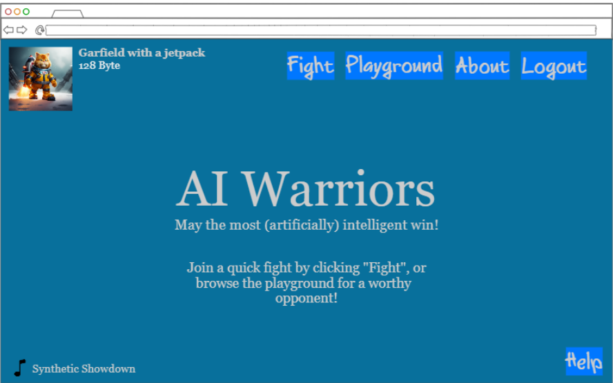
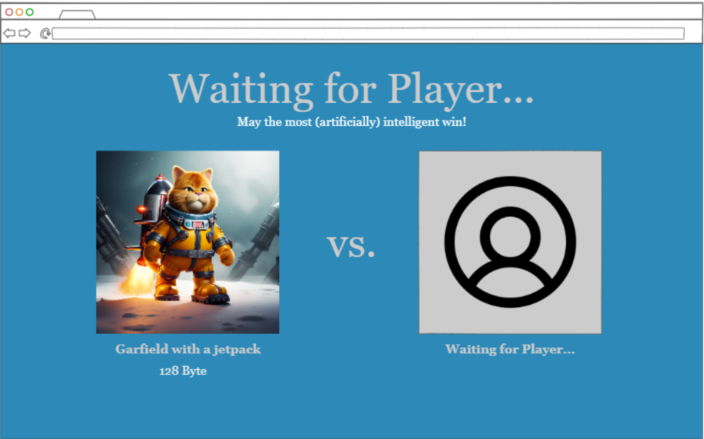
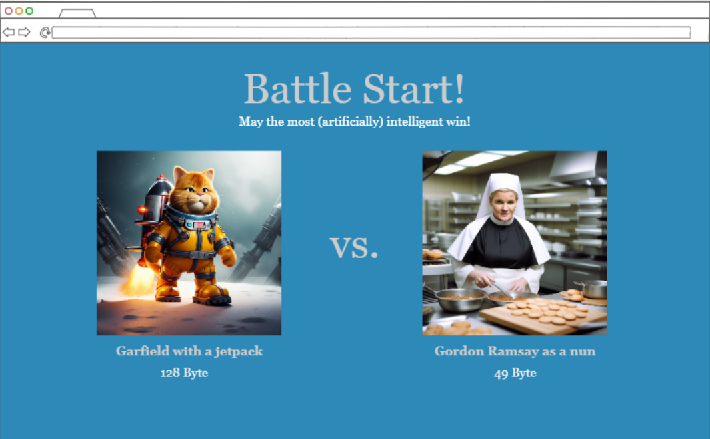
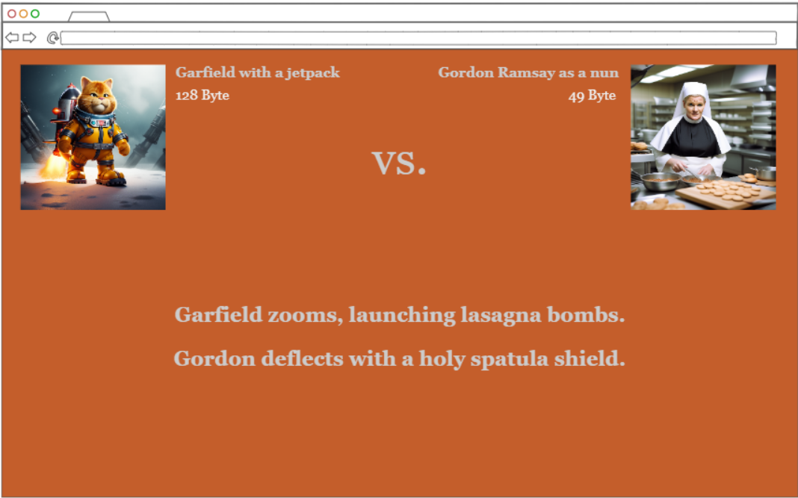
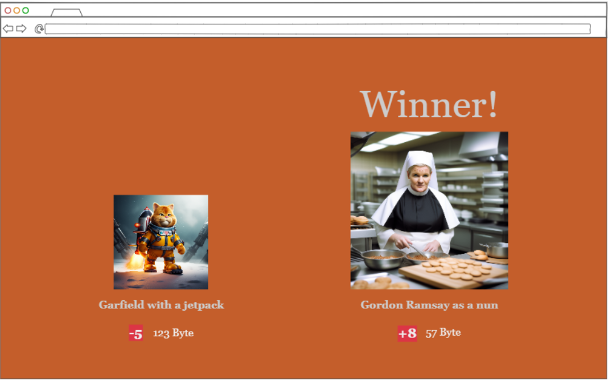

# AI Warriors
A startup application for BYU CS 260: Web Programming.

Notes for the course can be found [here](https://github.com/ethanwait25/startup/blob/main/notes.md).

## Specification

### Elevator Pitch
The recent explosion of interest in generative AI has raised a number of controversies and debates regarding data privacy violations, copyright issues, workplace replacement fears, and the spread of false information. But why worry about any of that? Let's just have fun!

AI Warriors is a multiplayer pseudo-RPG, all powered by generative AI. Users create an avatar (a "Synth") for which the sky's the limit! Would you like to play as a polar bear with chainsaw hands? How about a mug of root beer? Your choice of character will have a significant impact on its ability to survive in the arena. Go head-to-head with other Synths from across the globe to compete for ultimate power and glory! May the most (artificially) intelligent win!

### Design

### Key Features
- Secure login over HTTPS
- Ability to create custom Synth
- Auto-generated avatar photo using DALL-E
- Ability to start a Quick Fight
- Ability to browse online players in the playground and request a battle
- Ability to receive battle requests and accept or decline them
- Three rounds of auto-generated battle dialogue using ChatGPT API
- User levels and avatar photos persistently stored
- Toggleable (and shufflable) soundtrack written by the developer

### Technologies
This project will utilize the following technologies:
- **HTML** - Project uses HTML for structure. Six HTML pages: Home, login, playground, battle, about, and help.
- **CSS** - Application styling that is consistent across pages. Easily readable text (good contrast between background and text). The background will be textured and move somehow. The fight background color will change.
- **JavaScript** - Provides login, playground user display, animations in battle, backend endpoint calls.
- **Service** - Backend service with endpoints for login, avatar photo generation, and battle dialogue generation. Endpoints will also be used to retrieve, update, and store player level.
- **Database** - Users, avatar photos, player level, etc. stored in the database. Register and login users, with credentials securely stored in the database. Users cannot play unless authenticated.
- **WebSocket** - Used to join the next ready player to an open Quick Fight. Also utilized to send battle requests to online users and to accept/decline them. May also possibly include a list of recent battle results on the playground page which updates in real-time.
- **React** - Application ported to use the React web framework.

## HTML Deliverable
For this deliverable, I built the structure of my application using HTML.

* <b>HTML pages</b> - Five HTML pages that provide structure for a home page, a login and register page, a battle page, a challenger catalogue, and an about page.
* <b>Links</b> - The home, playground, about, and login pages have links to each of the five pages. The fight page has a link back to the homepage through the "Forfeit" option. On the playground page, clicking on any challenger will initiate a battle through a link to the fight page. Logging in or registering on the login page will take the user back to the home page.
* <b>Text</b> - Each page contains placeholder and informational text, much of which will remain in the final product.
* <b>Images</b> - The home, playground, and about pages contain a placeholder user avatar image which will eventually appear in the top left corner of the final product. The fight page contains placeholder user and challenger avatar images. The playground page contains a table of placeholder challenger avatar images.
* <b>Service call placeholders</b> - The login page contains an input box for new users to write their character prompts. Eventually, this data will be used to call the DALLE API to generate the user avatar. The fight page also contains example battle dialogue which will be rendered after a call to the ChatGPT API.
* <b>Login placeholder</b> - Login functionality is found on the login page. Once logged in, the user's name and other data will be shown at the top of the home, playground, and about pages as shown.
* <b>Database data placeholder</b> - All users' character names, current levels, and avatar images will all be stored in the database. A user's own data will be rendered on the home, fight, playground, and login pages as shown. Challenger data (also stored in the database) is shown on the playground and fight pages.
* <b>WebSocket data placeholder</b> - The three phases of battle dialogue represented on the fight page will be pushed out to both players in real-time. The playground page will also show real-time data of currently-online players, and will update as users enter or leave the playground page.

## CSS Deliverable
For this deliverable, I used CSS to style the structure I built in the previous section.

* <b>Header, footer, and main content body</b> - Styled the headers and footers on each of the pages. The main content of each page's body has also been styled.
* <b>Navigation elements</b> - Each page (except for the battle page) has a navigation bar at the top. Each navigation bar utilizes a flexbox to display the links horizontally. Hover over each link in the navigation bar to see some fun, responsive animations.
* <b>Responsive to window resizing</b> - The navigation bar on each page utilizes flex to dynamically change size based on the window width. Various other pages on the site use flexboxes to ensure content can be viewed on different sized screens. One notable example of this is the challenger selection screen on the Playground page - each challenger is an element in a flexbox which wraps elements on the next line once a row is filled. Resizing this window will change the number of elements per row.
* <b>Application elements</b> - Good whitespace and consistent color use. Lots of use of keyframe animation, which was very fun to do. Hover over the images and text on the fight page to see a sample animation representing how the page will animate when a battle begins. The playground page also has hover animations.
* <b>Application text content</b> - Used consistent fonts throughout. Fonts are supposed to evoke a techy, robotic feel.
* <b>Application images</b> - The placeholder images are still being used, which will eventually be dynamically updated with the avatars of the user and their challengers.

## JavaScript Deliverable
For this deliverable, I implemented client-side JavaScript functionality that will soon be used to create a multiplayer game. Additionally, placeholders have been added for some future technology.

* <b>Login</b> - Added base functionality to the Login page. When an account is created or logged into, the user's information is stored. If a user attempts to leave account creation before generating their character, they are forced to create an avatar before being allowed to access other pages on the site.
* <b>Database</b> - When a user logs in, their Synth (character) name is loaded dynamically into menu bars and on the fight page. Currently, this is stored and retrieved from local storage, but it will be replaced with the database at a later stage.
* <b>WebSocket</b> - Created placeholder dialogue displays which will be sent from the server to the battling users during battle sequences. This will be replaced with Websockets at a later stage. Also created a placeholder battle sequence start, which will be replaced eventually by a server message to the clients through WebSocket.
* <b>Application Functionality</b> - Battle sequences now play when manually activated from the fight page. Navigate to the battle page and click "Battle Start!" at the top of the window, then click anywhere on screen as dialogue appears to continue the battle sequence. In later phases, this will not be manually activated, but activated through a WebSocket message to the application to begin. Also added music functionality, in which tracks can be muted and skipped to shuffle the soundtrack.

## Services Deliverable
For this deliverable, I created an HTTP Service. My application calls that backend service from the frontend to request and update users' scores. I also added third-party API calls that complete the funcitonality of my game.

* <b>Node.js/Express HTTP service</b> - Finished! Created HTTP service using both.
* <b>Static middleware for frontend</b> - Finished! The pages are served up through the Express static middleware.
* <b>Calls to third party endpoints</b> - Implemented the calls to APIs from both Prodia and OpenAI, which provides the image generation and fight dialogue generation functionality. Click "login" and "register", then navigate to "fight" after completion to see this in action.
* <b>Backend service endpoints</b> - The backend now supports API calls to GET /score and POST /score, which return a specific user's store (specified through a query parameter) and update a specified users score, respectively.
*<b>Frontend calls service endpoints</b> - The frontend calls these endpoints using fetch() and uses the returned data to display the user's "Byte" (level/score) throughout the site.